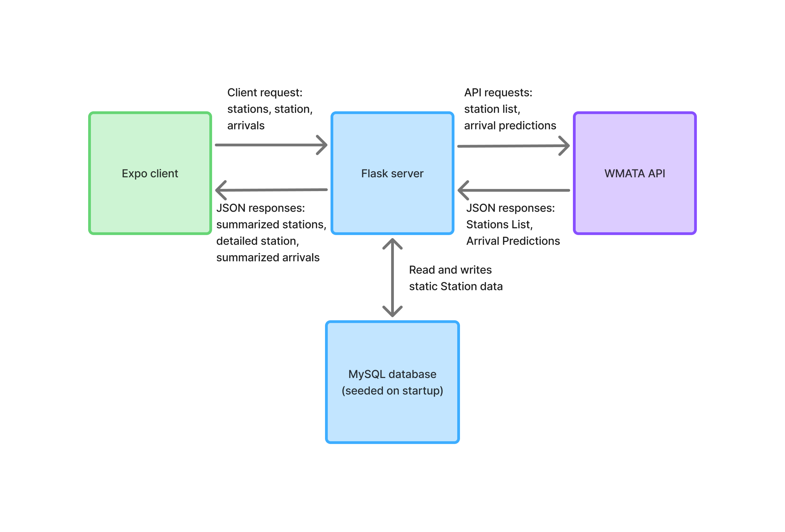

# System Overview

## Architecture Diagram

## Core Components

- **Expo Client**: A React Native mobile app that allows users to select a station and view upcoming train arrivals, refreshed every 20 seconds.
- **Flask Server**: Handles API requests from the client, fetches live arrival predictions from the WMATA API, and serves static station and line data from the database.
- **MySQL Database**: Stores static station and line data, seeded once from the WMATA API on startup.
- **WMATA API**: Third-party API that provides real-time train arrival predictions and station/line information.

## Data types

### Static (MySQL)

- **Station** — code, name, lat, lon, line codes, address, station_together codes
- **Line** — line_code, display_name, start/end station codes

### Dynamic (WMATA API)

- **Raw train prediction** — LocationCode, Group, Line, DestinationName, Min, Car

### Transformed (Flask → Client)

- **StationDropdown** — label, value, itemAccessibilityLabelField
- **StationDetail** — name, code[]
- **TrainArrivals** — dictionary keyed by `{LocationCode}-{Group}`, each containing a list of `{line, destination_name, minutes, car_count}`

## Data Flow

### On Startup
1. Flask checks if the database is empty
2. If empty, seeds static station data from the WMATA API into MySQL
3. Expo client requests the full station list from Flask
4. Flask retrieves station data from MySQL and returns it to the client
5. Client populates the station dropdown

### On User Interaction
1. User selects a station from the dropdown in the Expo client
2. Client requests station details from the Flask server
3. Flask retrieves static station data from MySQL and returns it to the client
4. Client begins polling the Flask server for train arrivals every 20 seconds
5. Flask fetches live arrival predictions from the WMATA API
6. Flask groups the predictions by platform and returns them to the client
7. Client displays the grouped arrivals in a table
